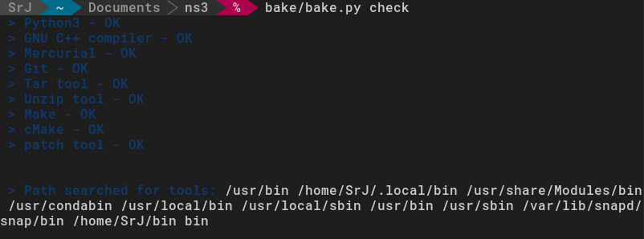
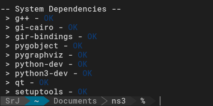
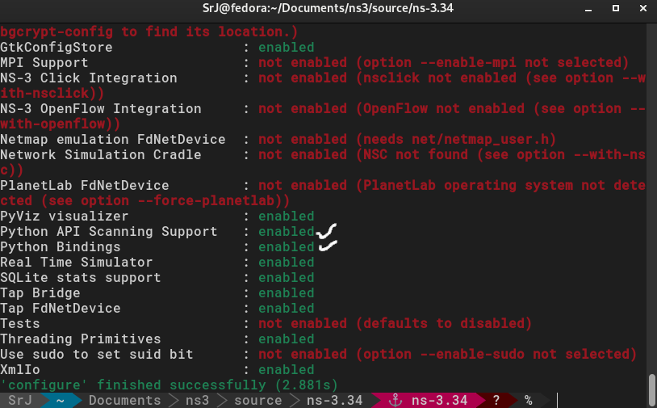
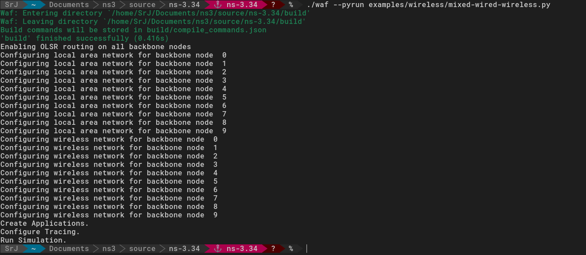

# network simulator 3 with python binding
---
*environment:*

*os* : `Fedora Workstation 34` 

*python* : `3.9.9`

---

- install all the library mentioned in the ns3 installation guide using your package manager ( `dnf` for fedora, `apt-get` for ubuntu; *package names might differ for different os. Refer to official ns3 installation guideline for appropriate name* )
````bash
sudo dnf install gcc-c++ python3 python3-devel git gsl gsl-devel
sudo dnf install gtk3 gtk3-devel gdb valgrind doxygen graphviz ImageMagick
sudo dnf install python3-sphinx dia texlive texlive-latex texlive-fncychap texlive-capt-of texlive-tabulary texlive-eqparbox
sudo dnf install texlive-epstopdf texlive-titlesec texlive-framed texlive-dvipng texlive-threeparttable texlive-wrapfig
sudo dnf install texlive-multirow
sudo dnf install tcpdump sqlite sqlite-devel libxml2 libxml2-devel
sudo dnf install uncrustify openmpi openmpi-devel environment-modules
sudo dnf install pygobject3-devel python3-gobject gobject-introspection-devel goocanvas2-devel graphviz-devel graphviz ipython
sudo dnf install cmake clang-devel llvm-devel llvm-static
pip3 install --user cxxfilt
sudo dnf install make patch autoconf cvs
````
The above installation packages were taken from ns3 website. The only changes i needed to make are below

````bash
sudo dnf install qt5-qtbase-devel  #instead of qt5-devel
sudo dnf install python3-pygraphviz #instead of easy_install pygraphviz
````

- create a new directory in your desired place for ns3. *(make sure the path to this directory for root doesn't contain any space, use `pwd` and check if there is any space in the path outputed)*
````bash
mkdir ns3
````
- download bake
````bash
git clone https://gitlab.com/nsnam/bake
````
- you can add bake to your environment variables or can directly execute it from `bake` folder that is just created by the git clone
````bash
 export BAKE_HOME=`pwd`/bake 
 export PATH=$PATH:$BAKE_HOME
 export PYTHONPATH=$PYTHONPATH:$BAKE_HOME
````
- check if all necessary tools are ready for ns3 installation
````bash
bake.py check  

#if not added to env variable
# bake/bake.py check
````
- the output should be something like below



- before downloading and building ns-3 you need to configure bake to inform it which are the modules you want added to ns-3
````bash
bake.py configure -e ns-3.34
bake.py show
````
- the output will be something like below



- if `python-dev` shows error in the above output, run the following
````bash
sudo dnf install python2-devel
````
- start installing ns3. It will take some time. Sit tight.
````bash
bake.py deploy
````
- now check that there are some new folders in the directory. Hop into the `source/ns-3.34` folder
````bash
cd source/ns-3.34
````
- now configure the waf
````bash
./waf configure
````
- now check whether `Python API Scanning Support` and `Python Bindings` are enabled in the output. If they show `not enabled`, then there will some message like `xxx missing`. Use `pip` to install that missing package. Keep installing these missing packages until it shows enabled.



- to check whether the installation was successful and ns3 runs on your machine, run the following code and see if it generates output ( some `.pcap` files )
````bash
./waf --pyrun examples/wireless/mixed-wired-wireless.py
````


### References
- https://www.nsnam.org/wiki/Python_bindings
- https://www.nsnam.org/wiki/Installation#Installation
- https://pybindgen.readthedocs.io/en/latest/tutorial/#supported-python-versions
- and millions of stackoverflow threads ...


